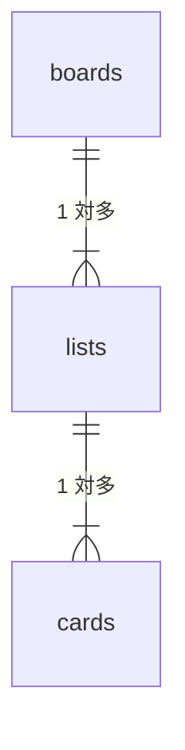

# データベース設計

| 項目 | 内容 |
| ---- | ---- |
| 文書名 | データベース設計 |
| 関連 | [要件定義書](../要件定義書【タスク管理アプリ】.md) / [API 設計](./API設計.md) |
| DBMS | MySQL 8.x |
| 版数 | 1.0 |

---

## 1. 設計方針

| 項目 | 方針 |
| ---- | ---- |
| 正規化 | boards / lists / cards を別テーブルに分割 |
| 利用形態 | シングルユーザー（users テーブルなし） |
| ボード | id=1 固定運用 |
| DDL | `trello-app/server/db/schema.sql` |
| 初期データ | `trello-app/server/db/seed.sql` |

---

## 2. ER 図

詳細・PNG は以下を参照。

| 資料 | パス |
| ---- | ---- |
| ER 図（Mermaid + PNG） | [trello-app/server/db/ER図.md](../trello-app/server/db/ER図.md) |
| 概念 ER（PNG） | `trello-app/server/db/er-concept.png` |
| 物理 ER（PNG） | `trello-app/server/db/er-physical.png` |

### 概念 ER（概要）

---

## 3. テーブル一覧

| テーブル | 説明 |
| -------- | ---- |
| boards | ボード（1 件固定） |
| lists | リスト列（やること / 進行中 / 完了） |
| cards | タスクカード |

---

## 4. テーブル定義

### boards

| 列名 | 型 | キー | 説明 |
| ---- | -- | ---- | ---- |
| id | INT UNSIGNED | PK, AI | ボード ID |
| title | VARCHAR(255) | | ボード名 |
| created_at | TIMESTAMP | | 作成日時 |
| updated_at | TIMESTAMP | | 更新日時 |

### lists

| 列名 | 型 | キー | 説明 |
| ---- | -- | ---- | ---- |
| id | INT UNSIGNED | PK, AI | リスト ID |
| board_id | INT UNSIGNED | FK → boards.id | 所属ボード |
| title | VARCHAR(255) | | リスト名 |
| sort_order | INT UNSIGNED | IDX | 表示順 |

### cards

| 列名 | 型 | キー | 説明 |
| ---- | -- | ---- | ---- |
| id | INT UNSIGNED | PK, AI | カード ID |
| list_id | INT UNSIGNED | FK → lists.id | 所属リスト |
| title | TEXT | | タスク名 |
| sort_order | INT UNSIGNED | IDX | 表示順 |

---

## 5. 外部キー

| FK | 子 → 親 | ON DELETE |
| -- | ------- | --------- |
| fk_lists_board | lists.board_id → boards.id | CASCADE |
| fk_cards_list | cards.list_id → lists.id | CASCADE |

---

## 6. 初期データ

| テーブル | 内容 |
| -------- | ---- |
| boards | id=1, マイタスクボード |
| lists | やること / 進行中 / 完了 |
| cards | list_id=1, はじめてのタスク |

---

## 改訂履歴

| 版数 | 日付 | 改訂内容 |
| ---- | ---- | -------- |
| 1.0 | 2026/05/21 | 要件定義書から分離 |
