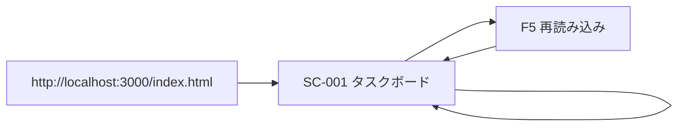
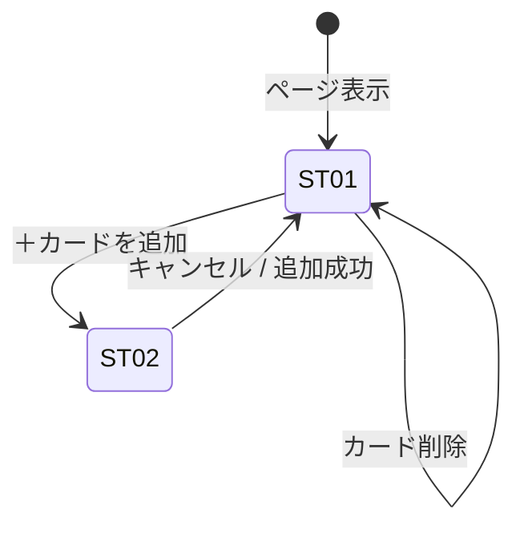
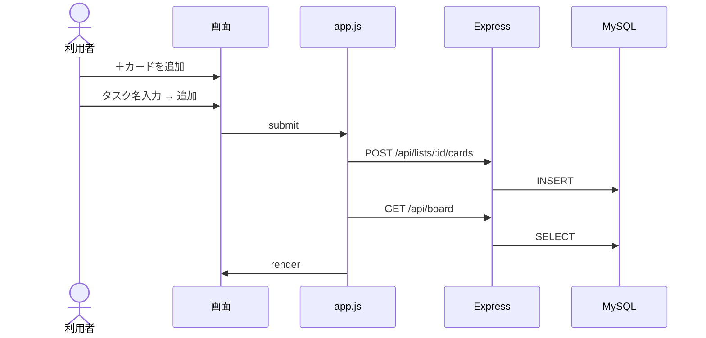
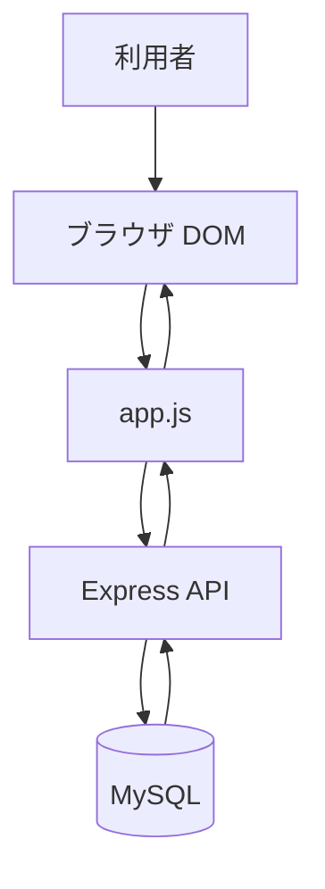

# 基本設計（フロー・遷移）

| 項目 | 内容 |
| ---- | ---- |
| 文書名 | 基本設計 |
| 関連 | [画面設計](./画面設計.md) / [API 設計](./API設計.md) / [データベース設計](./データベース設計.md) |
| 版数 | 1.0 |

画面・データの流れを図で整理する。

---

## 1. 画面遷移（ページ単位）

Phase 2 では **画面 1 枚**（SC-001）のみ。

| 遷移 ID | トリガー | 備考 |
| ------- | -------- | ---- |
| NAV-01 | 初回アクセス | サーバー経由で開く |
| NAV-02 | F5 | API → MySQL から復元 |

---

## 2. UI 状態遷移（カード追加）

---

## 3. 操作シーケンス（カード追加）

---

## 4. データフロー（全体）

| 処理 | フロー | 関連 FR |
| ---- | ------ | ------- |
| 起動 | GET /api/board | FR-021, FR-022 |
| 追加 | POST → GET /api/board | FR-010, FR-020 |
| 削除 | DELETE → GET /api/board | FR-012, FR-020 |

---

## 改訂履歴

| 版数 | 日付 | 改訂内容 |
| ---- | ---- | -------- |
| 1.0 | 2026/05/21 | 要件定義書から分離 |
