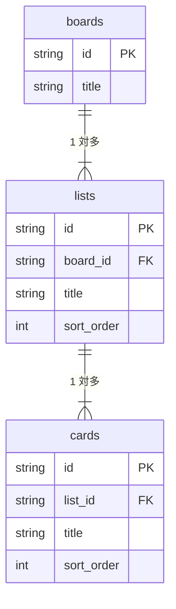
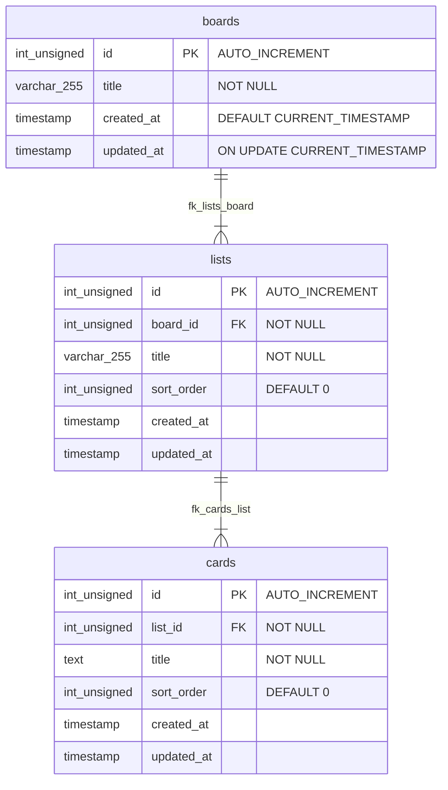
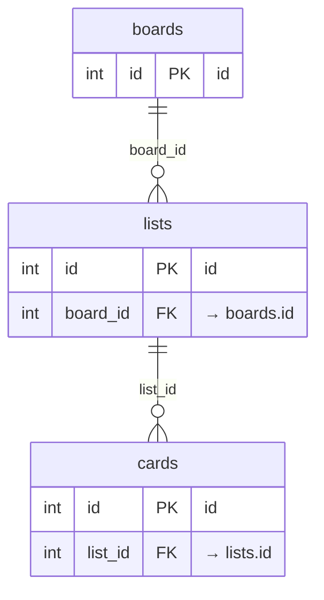
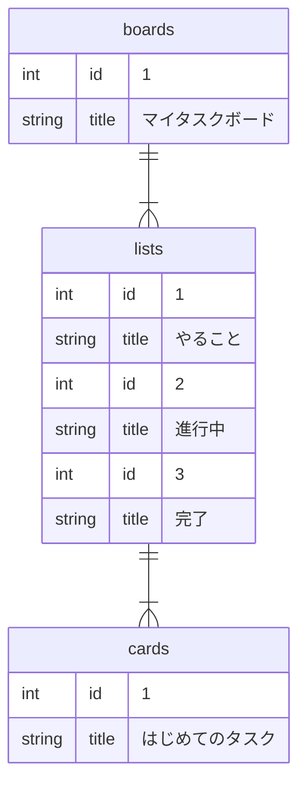

# ER 図（Mermaid）— タスク管理アプリ

MySQL テーブル設計に対応する ER 図。`schema.sql` と整合する。

## PNG 画像（提出用）

| ファイル | 内容 |
| -------- | ---- |
| [er-concept.png](./er-concept.png) | 概念 ER 図 |
| [er-physical.png](./er-physical.png) | 物理 ER 図（全列） |
| [er-fk.png](./er-fk.png) | FK リレーション図 |

ソース（Mermaid）: `er-concept.mmd` / `er-physical.mmd` / `er-fk.mmd`

---

## 1. 概念 ER 図（エンティティと関連）



| 関連 | カーディナリティ | 意味 |
| ---- | ---------------- | ---- |
| boards ── lists | **1 : N** | 1 つのボードに複数リスト（Phase 2 は 3 列固定） |
| lists ── cards | **1 : N** | 1 つのリストに複数カード（0 件可） |

---

## 2. 物理 ER 図（MySQL テーブル）



---

## 3. リレーション詳細



| FK 名 | 子テーブル.列 | 親テーブル.列 | ON DELETE | ON UPDATE |
| ----- | ------------- | ------------- | --------- | --------- |
| fk_lists_board | lists.board_id | boards.id | CASCADE | CASCADE |
| fk_cards_list | cards.list_id | lists.id | CASCADE | CASCADE |

---

## 4. データ例（seed 適用後）



> **Note:** Mermaid の erDiagram では同一エンティティの複数インスタンス表現に制限があるため、データ例は上記のとおり簡略表示とする。実データは `seed.sql` を参照。

**seed.sql の内容**

```
boards (id=1, マイタスクボード)
  ├── lists (id=1, やること)
  │     └── cards (id=1, はじめてのタスク)
  ├── lists (id=2, 進行中)
  └── lists (id=3, 完了)
```

---

## 5. 関連ファイル

| ファイル | 内容 |
| -------- | ---- |
| `schema.sql` | CREATE TABLE（DDL） |
| `seed.sql` | 初期データ（DML） |
| `../要件定義書【タスク管理アプリ】.md` 第 7.5 章 | 列定義の詳細 |

---

## 6. スコープ外（ER に含めない）

シングルユーザー・マルチ非対応のため、以下のエンティティは **Phase 2 では定義しない**。

| エンティティ | 理由 |
| ------------ | ---- |
| users | ログイン・マルチユーザー非対応 |
| memberships | ボード共有非対応 |
| sessions | 認証なし |
