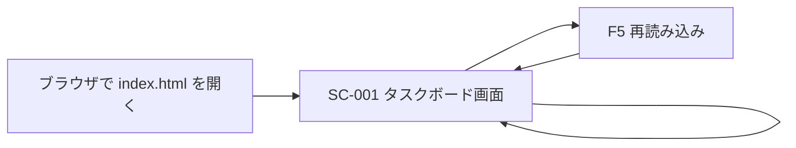
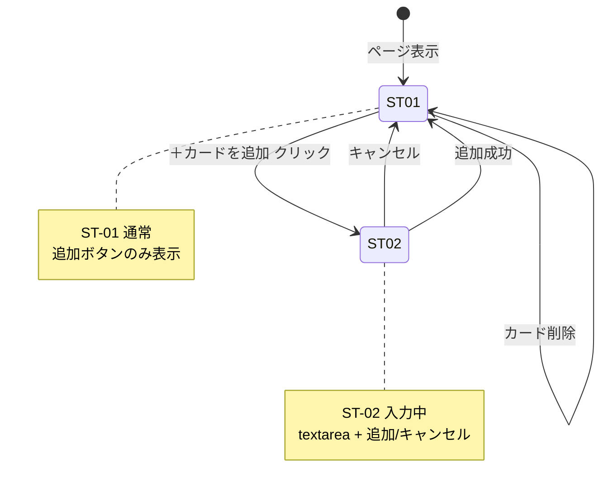
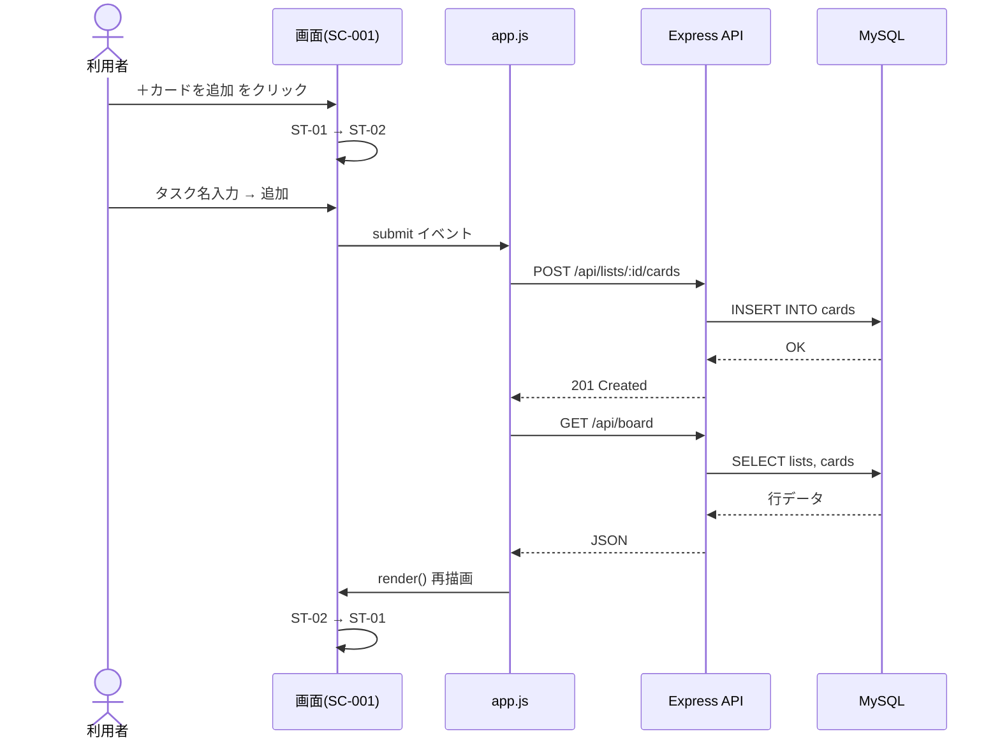
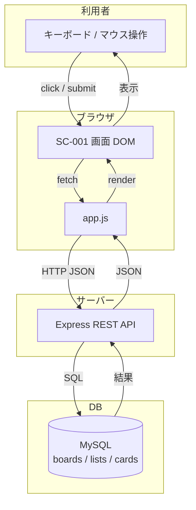
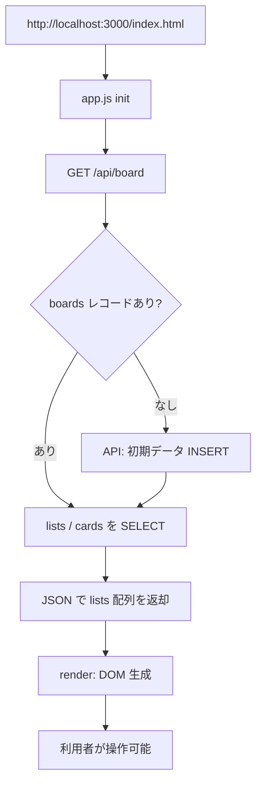
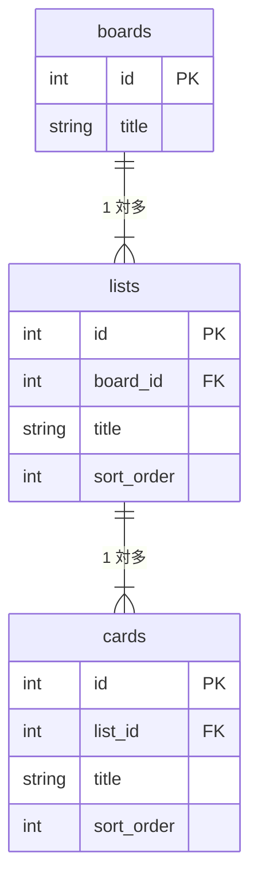
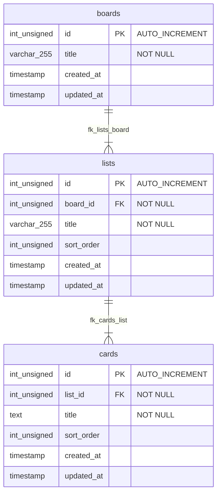
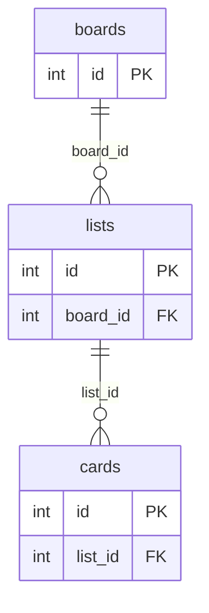

# 要件定義書【タスク管理アプリ】

| 項目       | 内容                               |
| ---------- | ---------------------------------- |
| 文書名     | 要件定義書【タスク管理アプリ】     |
| システム名 | タスク管理アプリ（シンプルタスクボード） |
| 版数       | 1.3                                |
| 作成日     | 2026年5月19日                      |
| 作成者     | （氏名を記入）                     |
| 所属       | （学校名・クラス名を記入）         |
| 実装場所   | `trello-app/`（フロント）+ `trello-app/server/`（API・DB） |

---

## 1. はじめに

### 1.1 背景

個人やチームでタスクを管理する際、紙のメモやチャットだけでは、**進捗の把握**や**やるべきことの整理**が難しくなる。  
Trello のような **カンバン方式**（リストとカードで状態を視覚的に管理する方式）のツールは、タスク管理に有効である。

本プロジェクトでは、スクールのシステム開発演習として、**Web ブラウザ上で動作するタスク管理アプリ**を開発する。

### 1.2 目的

- タスクを「やること」「進行中」「完了」の **3段階** で整理できるようにする
- **初心者でも使いやすい** シンプルな操作画面を提供する
- システム開発の一連の流れ（要件定義 → 設計 → 実装 → テスト）を学ぶ

- **フロントエンド + バックエンド + DB** の 3 層構成を体験し、Web アプリの基本構造を学ぶ
- ER 図に基づく RDBMS 設計と REST API の実装を行う

### 1.3 本書の目的

本要件定義書は、タスク管理アプリが **何を満たすべきか** を明確にし、設計・実装・テストの基準とするものである。

### 1.4 アーキテクチャ方針（スクール課題として）

本課題では **バックエンド（API サーバー）+ MySQL** を作る想定とする。スクールのシステム開発演習として問題ない範囲である。

| 項目 | 方針 |
| ---- | ---- |
| 構成 | **3 層** … フロント（HTML/JS）→ API（Node.js/Express）→ DB（MySQL） |
| 学習目的 | ER 図、SQL、REST API、フロントとサーバーの役割分担 |
| 利用規模 | **1 人・1 ボード** … 個人の ToDo 管理（授業・課題の整理） |
| マルチ対応 | **Phase 2 では不要** … 後述 1.5 のとおり実装しない |

```
[ブラウザ]  ←fetch→  [Express API]  ←SQL→  [MySQL]
  app.js              server.js          boards/lists/cards
```

### 1.5 マルチ対応について（対象外の明示）

「マルチ対応」として **本 Phase では実装しない** 機能を以下に固定する。

| 対象外 | 内容 | 理由 |
| ------ | ---- | ---- |
| マルチユーザー | ログイン・ユーザー登録・権限管理 | 課題範囲外。DB に users テーブルは作らない |
| データ共有 | 複数人での同時利用・他者とのボード共有 | 1 人利用を前提 |
| 複数ボード | ボード作成・切り替え UI | ボード id=1 固定で十分 |
| マルチ端末同期 | クラウドアカウント連携 | 将来拡張（FR-102, FR-103） |

**補足:** MySQL を使うが、利用者は **事実上 1 人** とみなす。API に認証ヘッダーは設けない。

### 1.6 開発スコープ（対象範囲）

| 区分           | 内容                                           |
| -------------- | ---------------------------------------------- |
| **Phase 2（現在）** | バックエンド API + MySQL 永続化（**シングルユーザー**） |
| **Phase 3 以降** | カード編集、D&D 等（マルチ機能は含まない） |
| **対象外**     | ログイン、複数ボード、ユーザー間共有、スマホ専用アプリ |

---

## 2. 用語定義

| 用語         | 説明                                                                 |
| ------------ | -------------------------------------------------------------------- |
| ボード       | タスクを管理する全体の領域。本システムでは **1つ固定** とする        |
| リスト       | ボード内の縦列。タスクの **状態（例：やること）** を表す               |
| カード       | リスト内の1枚のタスク。タイトル（名称）を持つ                        |
| カンバン方式 | リストを列として並べ、カードを状態に応じて管理する方式               |
| localStorage | ブラウザ内保存（Phase 1 のみ。Phase 2 以降は MySQL に移行） |
| RDBMS        | リレーショナルデータベース。本システムでは **MySQL** を使用   |
| REST API     | HTTP（GET / POST / DELETE）でフロントと DB を仲介する API   |
| シングルユーザー | ログインなし・1 ボード固定の利用形態（マルチユーザー非対応） |

---

## 3. ユーザーと利用シーン

### 3.1 想定ユーザー

| 項目     | 内容                                           |
| -------- | ---------------------------------------------- |
| 主ユーザー | 学生・個人利用者（PC ブラウザを利用できる人） |
| 利用人数   | **1 人**（ログインなし。全員が同一ボード id=1 を利用） |
| IT スキル  | パソコン初心者〜中級者                         |

### 3.2 利用シーン

1. **授業・課題の整理** … レポート提出などを「やること」に登録し、完了したら「完了」へ
2. **日々の ToDo 管理** … 買い物・連絡などのメモをカードとして追加
3. **進捗の可視化** … 3列のリストで、今どの段階にあるか一目で確認

---

## 4. 機能要件

各要件には ID を付与する。実装・テスト時のトレーサビリティ（追跡）に使用する。

### 4.1 ボード・リスト表示

| ID     | 要件名           | 要件内容                                                                 | 優先度 |
| ------ | ---------------- | ------------------------------------------------------------------------ | ------ |
| FR-001 | ボード表示       | システム起動時、1つのボード上にリストを **横並び** で表示すること        | 必須   |
| FR-002 | 初期リスト       | 起動時、以下3つのリストを表示すること：「やること」「進行中」「完了」   | 必須   |
| FR-003 | カード一覧表示   | 各リスト内に、そのリストに属するカードを **縦に並べて** 表示すること     | 必須   |

### 4.2 カード操作

| ID     | 要件名       | 要件内容                                                                 | 優先度 |
| ------ | ------------ | ------------------------------------------------------------------------ | ------ |
| FR-010 | カード追加   | 各リストで「＋ カードを追加」から、タスク名を入力してカードを追加できること | 必須   |
| FR-011 | 入力検証     | 空白のみのタスク名ではカードを追加 **しない** こと                       | 必須   |
| FR-012 | カード削除   | 各カードから削除操作（×ボタン）により、カードを削除できること            | 必須   |
| FR-013 | 追加キャンセル | カード追加フォームをキャンセルし、入力内容を破棄できること             | 必須   |

### 4.3 データ永続化（Phase 2：MySQL）

| ID     | 要件名       | 要件内容                                                                 | 優先度 |
| ------ | ------------ | ------------------------------------------------------------------------ | ------ |
| FR-020 | DB 保存      | カードの追加・削除を **MySQL** に反映すること                             | 必須   |
| FR-021 | データ復元   | ページ再読み込み（F5）後、DB から前回のリスト・カード構成を **復元** すること | 必須   |
| FR-022 | 初回データ   | DB が空の場合、ボード・3 リスト・サンプルカード 1 件を自動投入すること     | 必須   |
| FR-023 | API 経由     | フロントは **REST API** 経由でのみ DB にアクセスすること（直接 SQL 不可） | 必須   |
| FR-024 | 外部キー整合 | リスト削除時に配下カードも整合性を保つこと（ON DELETE CASCADE）           | 必須   |

### 4.4 将来拡張（本 Phase では対象外・参考）

| ID     | 要件名           | 要件内容                         | 優先度 |
| ------ | ---------------- | -------------------------------- | ------ |
| FR-100 | カード編集       | 既存カードのタイトルを変更できる | 将来   |
| FR-101 | ドラッグ＆ドロップ | カードを別リストへ移動できる     | 将来   |
| FR-102 | 複数ボード       | ボードを複数作成・切り替えできる | 将来   |
| FR-103 | ユーザー認証     | ログイン・マルチユーザー共有       | 将来   |

---

## 5. 非機能要件

| ID      | 区分       | 要件内容                                                                 |
| ------- | ---------- | ------------------------------------------------------------------------ |
| NFR-001 | 動作環境   | Google Chrome または Microsoft Edge の **最新版** で正常動作すること     |
| NFR-002 | 対応画面   | PC ブラウザ（横幅 1024px 以上）を主対象とする（スマホ対応は Phase 1 対象外） |
| NFR-003 | 操作性     | 主要操作（追加・削除）は **3クリック以内** で完了できること              |
| NFR-004 | 表示速度   | 通常利用時、操作から画面反映まで **1秒以内** であること                  |
| NFR-005 | 可用性     | 同一 PC 上で API サーバー + MySQL が起動していれば利用可能             |
| NFR-006 | セキュリティ | 個人情報・パスワードを扱わない。DB はローカル MySQL に保存           |
| NFR-007 | 保守性     | フロント / サーバー / SQL を **ファイル分離** し、役割ごとに管理すること |
| NFR-008 | 認証       | ログイン **不要**（API は認証なし・シングルユーザー想定）              |

---

## 6. 画面要件

### 6.1 画面一覧

| 画面ID | 画面名           | 概要                                   |
| ------ | ---------------- | -------------------------------------- |
| SC-001 | タスクボード画面 | リスト・カードの表示および操作を行う唯一の画面 |

### 6.2 画面構成（SC-001：タスクボード画面）

```
┌─────────────────────────────────────────────────────────┐
│  ヘッダー：システム名「マイタスクボード」               │
├─────────────────────────────────────────────────────────┤
│  ┌──────────┐  ┌──────────┐  ┌──────────┐              │
│  │ やること  │  │ 進行中    │  │ 完了      │  （横スクロール可）│
│  │ ┌──────┐ │  │ ┌──────┐ │  │          │              │
│  │ │カード│ │  │ │カード│ │  │          │              │
│  │ └──────┘ │  │ └──────┘ │  │          │              │
│  │＋カード追加│  │＋カード追加│  │＋カード追加│              │
│  └──────────┘  └──────────┘  └──────────┘              │
└─────────────────────────────────────────────────────────┘
```

### 6.3 画面要素

| 要素           | 種類     | 説明                                   |
| -------------- | -------- | -------------------------------------- |
| リストタイトル | テキスト | リスト名（やること / 進行中 / 完了）   |
| カード         | テキスト | タスク名を表示                         |
| 削除ボタン（×） | ボタン   | カードを削除                           |
| カード追加ボタン | ボタン   | 入力フォームを表示                     |
| 入力欄         | テキストエリア | 新規カードのタイトルを入力       |
| 追加ボタン     | ボタン   | 入力内容でカードを作成                 |
| キャンセルボタン | ボタン | 入力を破棄しフォームを閉じる           |

---

## 7. 基本設計（設計図）

技術選定の前に、**画面・遷移・データ** の関係を図で整理する。本章の図は設計・実装・テストの共通理解を目的とする。

### 7.1 ER 図と DB 設計方針

| 観点 | 本プロジェクトでの判断 |
| ---- | ---------------------- |
| RDBMS 向け ER 図 | **必須** … MySQL で運用するため、テーブル・PK・FK を定義する |
| 正規化 | ボード / リスト / カードを **別テーブル** に分割（第 3 正規形を目標） |
| API 層 | フロントは REST API 経由。DB への直接接続はサーバー（Node.js）のみ |
| Phase 1（localStorage） | 学習用 MVP として実装済。Phase 2 で DB に移行 |

**結論:** 運用を見据え、**物理 ER 図（MySQL テーブル設計）** を正とし、`trello-app/server/db/schema.sql` に DDL を記述する。

### 7.2 画面構成図（SC-001）

Phase 1 は **画面 1 枚**（SC-001）のみ。複数 URL への遷移はない。

```
┌─────────────────────────────────────────────────────────────┐
│  AREA-02 ヘッダー                                            │
│  ┌─────────────────────────────────────────────────────┐   │
│  │ h1: マイタスクボード                                   │   │
│  │ hint: リストごとにカードを追加…（MySQL 保存の案内）       │   │
│  └─────────────────────────────────────────────────────┘   │
├─────────────────────────────────────────────────────────────┤
│  AREA-03 ボード（main#board）                                │
│  ┌─────────────┐  ┌─────────────┐  ┌─────────────┐          │
│  │ AREA-04     │  │ AREA-04     │  │ AREA-04     │          │
│  │ リスト       │  │ リスト       │  │ リスト       │          │
│  │ ┌─────────┐ │  │             │  │             │          │
│  │ │ カード   │ │  │             │  │             │          │
│  │ └─────────┘ │  │             │  │             │          │
│  │ AREA-06     │  │ AREA-06     │  │ AREA-06     │          │
│  │ ＋カード追加  │  │ ＋カード追加  │  │ ＋カード追加  │          │
│  └─────────────┘  └─────────────┘  └─────────────┘          │
└─────────────────────────────────────────────────────────────┘
```

| 区域 | 内容 | 備考 |
| ---- | ---- | ---- |
| AREA-02 | ヘッダー | 固定文言、操作なし |
| AREA-03 | ボード全体 | JS が 3 列のリストを動的生成 |
| AREA-04 | リスト列 | 「やること」「進行中」「完了」 |
| AREA-05 | カード一覧 | `.list__cards`、縦スクロール |
| AREA-06 | 追加 UI | 通常（ST-01）/ 入力中（ST-02） |

### 7.3 画面遷移図

**アプリ全体（ページ単位）**

Phase 1 では `index.html` の **1 画面のみ**。ページ間のリンク遷移はない。



| 遷移 ID | 起点 | 终点 | トリガー | 備考 |
| ------- | ---- | ---- | -------- | ---- |
| NAV-01 | — | SC-001 | 初回アクセス | 新規タブで HTML を開く |
| NAV-02 | SC-001 | SC-001 | F5 / 再アクセス | 同一画面。データは **API → MySQL** から復元 |

**UI 状態遷移（カード追加エリア・リストごと）**

画面は 1 枚だが、**追加 UI の表示状態** が遷移する。



| 状態 ID | 名称 | 表示内容 | 遷移先 |
| ------- | ---- | -------- | ------ |
| ST-01 | 通常 | 「＋ カードを追加」ボタン | ST-02（追加クリック） |
| ST-02 | 入力中 | テキストエリア + 「追加」「キャンセル」 | ST-01（キャンセル / 追加成功） |

**操作シーケンス（カード追加）**



### 7.4 データフロー図

**全体像（Phase 2：MySQL 運用）**



**処理別データフロー**

| 処理 | 入力 | 処理 | 出力 | 関連 FR |
| ---- | ---- | ---- | ---- | ------- |
| 起動 | — | GET /api/board → JOIN 相当の SELECT | lists、画面描画 | FR-021, FR-022 |
| カード追加 | タスク名 | POST /api/lists/:id/cards → INSERT | DB 更新、再取得、DOM 更新 | FR-010, FR-020 |
| カード削除 | cardId | DELETE /api/cards/:id → DELETE | DB 更新、再取得、DOM 更新 | FR-012, FR-020 |
| 再読み込み | — | GET /api/board | DB から最新状態を復元 | FR-021 |

**起動時のデータフロー（詳細）**



### 7.5 物理 ER 図（MySQL テーブル設計）

Mermaid 記法の ER 図。**PNG 提出用:** `trello-app/server/db/er-concept.png` / `er-physical.png` / `er-fk.png`

#### 7.5.1 概念 ER 図

エンティティ間の **1 対多** 関係を示す。



#### 7.5.2 物理 ER 図（テーブル・列・FK）

`schema.sql` と一致する MySQL テーブル定義。



#### 7.5.3 FK リレーション図



| 関連 | カーディナリティ | FK | 削除時 |
| ---- | ---------------- | -- | ------ |
| boards → lists | 1 : N | lists.board_id → boards.id | CASCADE |
| lists → cards | 1 : N | cards.list_id → lists.id | CASCADE |

**テーブル定義（物理）**

| テーブル | 説明 | DDL ファイル |
| -------- | ---- | ------------ |
| `boards` | ボード（Phase 2 は id=1 固定運用） | `server/db/schema.sql` |
| `lists` | リスト列（やること / 進行中 / 完了） | 同上 |
| `cards` | タスクカード | 同上 |

**boards**

| 列名 | 型 | NULL | キー | 説明 |
| ---- | -- | ---- | ---- | ---- |
| id | INT UNSIGNED | NO | PK, AI | ボード ID |
| title | VARCHAR(255) | NO | | ボード名 |
| created_at | TIMESTAMP | NO | | 作成日時 |
| updated_at | TIMESTAMP | NO | | 更新日時 |

**lists**

| 列名 | 型 | NULL | キー | 説明 |
| ---- | -- | ---- | ---- | ---- |
| id | INT UNSIGNED | NO | PK, AI | リスト ID |
| board_id | INT UNSIGNED | NO | FK | 所属ボード |
| title | VARCHAR(255) | NO | | リスト名 |
| sort_order | INT UNSIGNED | NO | IDX | 表示順 |
| created_at | TIMESTAMP | NO | | 作成日時 |
| updated_at | TIMESTAMP | NO | | 更新日時 |

**cards**

| 列名 | 型 | NULL | キー | 説明 |
| ---- | -- | ---- | ---- | ---- |
| id | INT UNSIGNED | NO | PK, AI | カード ID |
| list_id | INT UNSIGNED | NO | FK | 所属リスト |
| title | TEXT | NO | | タスク名 |
| sort_order | INT UNSIGNED | NO | IDX | 表示順 |
| created_at | TIMESTAMP | NO | | 作成日時 |
| updated_at | TIMESTAMP | NO | | 更新日時 |

**初期データ（seed.sql）**

| テーブル | 内容 |
| -------- | ---- |
| boards | id=1, title=マイタスクボード |
| lists | やること(1), 進行中(2), 完了(3) |
| cards | list_id=1, title=はじめてのタスク |

### 7.6 API 設計（フロント ↔ サーバー）

| メソッド | パス | 説明 | 関連 FR |
| -------- | ---- | ---- | ------- |
| GET | `/api/board` | ボード＋リスト＋カード一覧 | FR-021 |
| POST | `/api/lists/:listId/cards` | カード追加 `{ title }` | FR-010, FR-020 |
| DELETE | `/api/cards/:cardId` | カード削除 | FR-012, FR-020 |
| GET | `/api/health` | DB 接続確認 | 運用 |

**GET /api/board レスポンス例**

```json
{
  "board": { "id": "1", "title": "マイタスクボード" },
  "lists": [
    {
      "id": "1",
      "title": "やること",
      "cards": [{ "id": "1", "title": "はじめてのタスク" }]
    }
  ]
}
```

### 7.7 設計図と実装の対応

| 図 | 本章 | 実装 |
| -- | ---- | ---- |
| 画面構成 | 7.2 | index.html, style.css |
| 画面遷移 | 7.3 | app.js |
| データフロー | 7.4 | app.js + server.js |
| 物理 ER | 7.5 | server/db/schema.sql |
| API | 7.6 | server/server.js |

---

## 8. データ要件

### 8.1 永続化方式

| 項目 | Phase 1（完了） | Phase 2（運用） |
| ---- | --------------- | --------------- |
| 保存先 | localStorage | **MySQL 8.x** |
| アクセス | app.js 直接 | **REST API** 経由 |
| スキーマ | JSON ネスト | **正規化テーブル 3 件** |

### 8.2 API レスポンス形式（フロント向け）

フロントは従来と同様 **lists 配列** で扱う。ID は DB の数値を文字列化して渡す。

```json
{
  "board": { "id": "1", "title": "マイタスクボード" },
  "lists": [
    {
      "id": "1",
      "title": "やること",
      "cards": [
        { "id": "1", "title": "はじめてのタスク" }
      ]
    }
  ]
}
```

### 8.3 テーブルとアプリ項目の対応

**lists テーブル**

| DB 列 | アプリ項目 | 型 | 必須 |
| ----- | ---------- | -- | ---- |
| id | リスト ID | INT → string | ○ |
| board_id | （内部）所属ボード | INT | ○ |
| title | タイトル | VARCHAR(255) | ○ |
| sort_order | 表示順 | INT | ○ |

**cards テーブル**

| DB 列 | アプリ項目 | 型 | 必須 |
| ----- | ---------- | -- | ---- |
| id | カード ID | INT → string | ○ |
| list_id | 所属リスト | INT | ○ |
| title | タイトル | TEXT | ○ |
| sort_order | 表示順 | INT | ○ |

### 8.4 DDL・初期データ

| ファイル | 内容 |
| -------- | ---- |
| `trello-app/server/db/schema.sql` | CREATE TABLE（boards / lists / cards） |
| `trello-app/server/db/seed.sql` | 初期ボード・リスト・サンプルカード |

---

## 9. 外部インタフェース・連携

| 項目 | 内容 |
| ---- | ---- |
| DB | MySQL 8.x（localhost） |
| API | REST JSON（Express） |
| フロント → API | fetch（同一オリジン `http://localhost:3000`） |
| 外部 SaaS | なし |

---

## 10. 技術選定

| レイヤ | 選定 | 選定理由 |
| ------ | ---- | -------- |
| UI | HTML5 + CSS3 | 既存 Phase 1 を継続 |
| フロント | JavaScript（Vanilla） | fetch で API 呼び出し |
| API | **Node.js + Express** | バックエンド層。スクール課題として REST API を実装 |
| DB | **MySQL 8.x** | ER 図・SQL 学習。users テーブルは **作らない**（シングルユーザー） |
| DB ドライバ | mysql2 | Promise 対応 |
| 設定 | dotenv + `.env` | 接続情報をコードから分離 |

**採用しなかった例**

| 候補 | 理由 |
| ---- | ---- |
| localStorage のみ | 複数端末・永続運用に不向き |
| SQLite | 学習には可。本課題では MySQL で ER/SQL を学ぶ |
| PHP + MySQL | 有効だが、フロントが JS のため Node で統一 |
| ORM（Prisma 等） | 演習では生 SQL / クエリで DB 理解を優先 |

---

## 11. 制約・前提条件

| 項目 | 内容 |
| ---- | ---- |
| 開発言語 | HTML / CSS / JavaScript、Node.js |
| 実行方式 | `server/` で `npm start` → `http://localhost:3000/index.html` |
| DB | MySQL 起動済み、`trello_app` DB 作成済み |
| スキーマ適用 | `schema.sql` → `seed.sql` の順で実行 |
| 認証 | **なし** | マルチユーザー非対応のため JWT / セッションは Phase 2 対象外 |
| データの扱い | ボード id=1 固定 | 全リクエストは同一ボードを参照（ユーザー識別なし） |
| 開発期間 | （スクールの指示に従い記入） |

---

## 12. 受け入れ基準（テスト観点）

以下をすべて満たした場合、Phase 1 の要件を満たしたとみなす。

| No | 確認項目                                           | 期待結果                         |
| -- | -------------------------------------------------- | -------------------------------- |
| 1  | 初回起動時、3つのリストが表示される                | FR-002 を満たす                  |
| 2  | 「＋ カードを追加」でカードを追加できる              | FR-010 を満たす                  |
| 3  | 空白入力で追加しようとしてもカードが増えない         | FR-011 を満たす                  |
| 4  | × ボタンでカードを削除できる                         | FR-012 を満たす                  |
| 5  | ページを再読み込みしてもデータが残る                 | FR-021（MySQL から復元）         |
| 6  | Chrome または Edge で上記が動作する                  | NFR-001 を満たす                 |
| 7  | MySQL に cards レコードが保存されている              | FR-020（phpMyAdmin 等で確認）    |
| 8  | API サーバー停止時はエラー表示される                 | 運用上の異常系                   |

---

## 13. 関連ドキュメント

| 文書名 | 説明 | 状態 |
| ------ | ---- | ---- |
| 本書 第 7 章 | ER 図・データフロー・API 設計 | 作成済 |
| `server/db/ER図.md` | Mermaid ER 図 | 作成済 |
| `server/db/schema.sql` | MySQL DDL | 作成済 |
| `server/db/seed.sql` | 初期データ | 作成済 |
| 基本設計書 | モジュール構成の詳細 | 未作成 |
| 詳細設計書 | 関数・処理フローの詳細 | 未作成 |
| テスト仕様書 | テストケース・結果記録 | 未作成 |
| 操作マニュアル | 利用者向けの使い方説明 | 未作成 |

---

## 改訂履歴

| 版数 | 日付       | 改訂者       | 改訂内容     |
| ---- | ---------- | ------------ | ------------ |
| 1.3  | 2026/05/21 | （氏名記入） | Mermaid ER 図（`server/db/ER図.md`）を追加 |
| 1.2  | 2026/05/21 | （氏名記入） | Phase 2: MySQL ER 図・API・サーバー実装 |
| 1.1  | 2026/05/21 | （氏名記入） | 第 7 章 基本設計（設計図）・第 10 章 技術選定を追加 |
| 1.0  | 2026/05/19 | （氏名記入） | 初版作成     |
